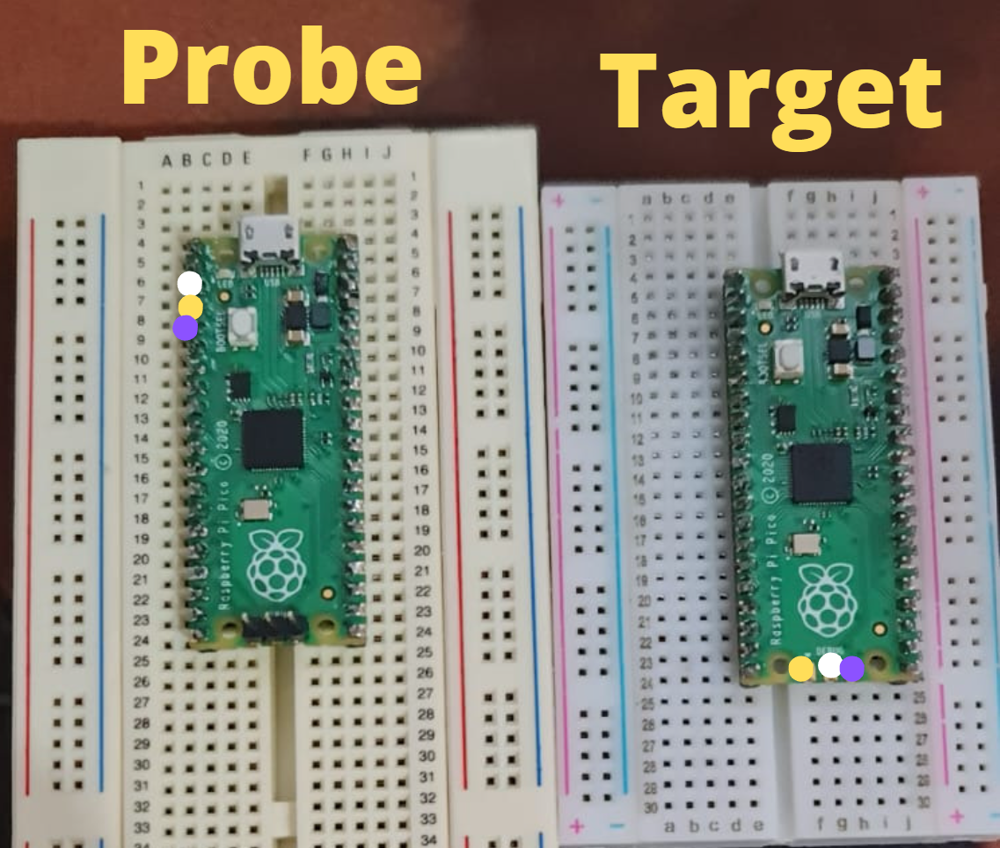
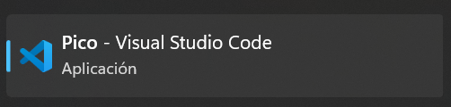

# Setup guide for using two RP2040 for debugging using [Yapicoprobe](https://github.com/rgrr/yapicoprobe)

## Getting started

### Windows users

1. Install the [Easy to use installer from the official repo site](https://github.com/raspberrypi/pico-setup-windows)

2. Connect both picos to your PC via USB (this is the setup I did on the [Issue #78](https://github.com/raspberrypi/picoprobe/issues/78) reported and worked for me).

3. Drag the [yapicoprobe-0112-pico-3590ff9.uf2](https://github.com/rgrr/yapicoprobe/releases/tag/rg-1.12) to your target, it should restart and be renamed as YAPicoprobe.

4. Your probe should start blinking its LED.

5. Wire your picos the following way.

6. After wiring your picos the probe's blinking should change.

7. Open your vs code, but the one installed by the pico-setup-windows installer and open the pico-examples folder and select one of your liking, for example the blinking example one.

8. Then hit the debug option menu and should be able to debug with your picos :).

Here I leave a video of the picos wired and the debugger working, if you can't see it on the github markdown reader, just head to the video folder in the repo.

